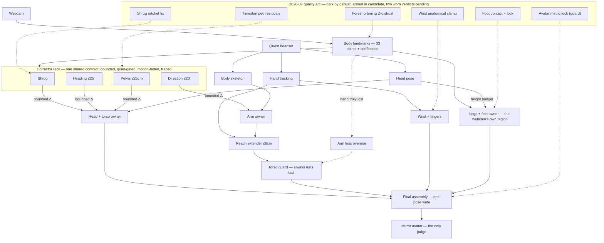

# TestingKit5 — MPQ Fusion

Live VR mirror embodiment for UE 5.8: a webcam (MediaPipe) and a Meta Quest
(HMD + hand tracking) fused in real time to drive MetaHuman avatars in a
mirror. You wear the headset, stand at the webcam, and the avatar in the
mirror moves as you do — shoulders, shrugs, arms, hands, fingers, legs.

## Running the demo

Prerequisites: a machine already set up per
[Docs/SETUP_NEW_MACHINE.md](Docs/SETUP_NEW_MACHINE.md) (UE 5.8, the MetaHuman
content payload, the mediapipe_wrapper DLLs), a USB webcam, and a Quest
connected over Link.

1. **Open the editor** (double-click `TestingKit5.uproject`). That is the
   whole setup: the editor loads the showcase room
   (`L_MetaHumanPreviewRoom_MPQSignalCompare_01`, saved default avatar:
   **Emory**) and `Content/Python/init_unreal.py` auto-arms the full live
   stack on every interactive boot — candidate settings variant, live
   lower-body trial, heavy pose model, and all diagnostic tracers.
   (Automation runs keep raw defaults; only interactive boots self-arm.)
2. Optional sanity check in the editor console: `mp.DumpLiveProfileSettings`
   — you want the **candidate** variant with the rescue/legs/panel CVars
   at 1. A boot that somehow missed the auto-arm is the RAW stack and looks
   broken; don't judge anything in that state.
3. Press **VR Preview**. Put the headset on, stand in front of the webcam,
   judge in the mirror. **Esc** stops the session.
4. **Switch avatars** between sessions — editor idle, not playing:

   ```
   mp.MirrorAvatar Kellan
   ```

   then VR Preview again. Valid ids: `Wallace`, `Emory`, `Hudson`, `Kellan`,
   `Maria`, `Payton`, `Manny` (the internal baseline skeleton). No argument
   prints the current selection. Nothing needs re-arming between sessions.

Never type `mp.MetaHumanActiveProfile` during a session — it hard-disables
the arm-chain retargeter and the avatar's shoulders collapse (details and the
instant recovery in [Docs/SETUP_NEW_MACHINE.md](Docs/SETUP_NEW_MACHINE.md)
§7c). `mp.MirrorAvatar` is the safe switch.

## Project shape

The architecture in one picture: the Quest headset owns the pose, the webcam
contributes bounded corrections through a rack of correctors sharing one
contract, everything meets exactly once at final assembly, and the mirror
avatar is the only acceptance judge. The dashed subgraph is the 2026-07
quality arc — built and tested, dark by default, armed only in the candidate
settings, awaiting two worn verdicts (the shrug ratchet fix and the avatar
metric lock).



The full interactive version — every box opens a dossier with its inner flow
chart, CVars, commits, and the story behind it (including the quality-arc
change list under *Where it stands*) — is
[Docs/PROJECT_SHAPE.html](Docs/PROJECT_SHAPE.html): download it and open it
in any browser, no server needed.

## Where everything else is

- **[Docs/README.md](Docs/README.md)** — the documentation index (active vs
  historical docs).
- **[Docs/SETUP_NEW_MACHINE.md](Docs/SETUP_NEW_MACHINE.md)** — full
  new-machine setup: what git carries vs the ~9 GB carry-by-hand payload,
  install list, first-build verification, live-mirror bring-up, field notes.
- **[AGENTS.md](AGENTS.md)** — operational rules for agents working in this
  repo (build wrapper, no Live Coding, bridge ports, dataset protection).

## Building and testing

Close the editor first (never Live Coding), then
`Tools\BuildTestingKit5EditorFast.ps1`. Headless test suite:

```bat
D:\Epic\UE_5.8\Engine\Binaries\Win64\UnrealEditor-Cmd.exe "D:\Epic\Unreal_Projects\TestingKit5\TestingKit5.uproject" -ExecCmds="Automation RunTests MediaPipe; Quit" -unattended -nopause -nosplash -log
```

Count `Test Completed. Result={Success}` lines: **208 as of 2026-07-12**,
zero failures expected. The count only grows.
